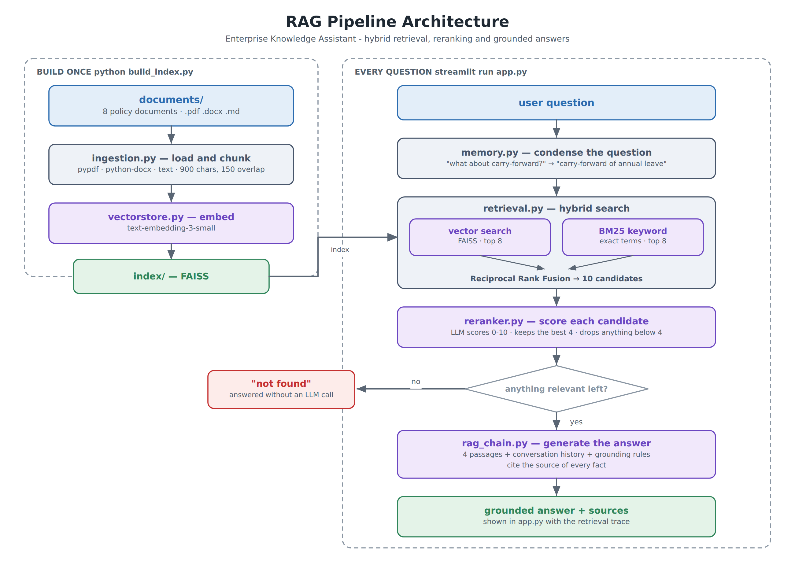
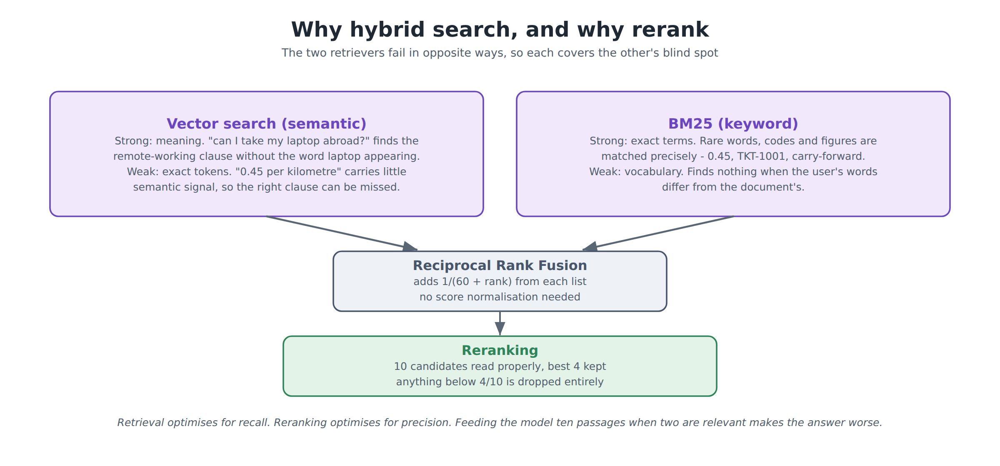

# Enterprise Knowledge Assistant — Advanced RAG

A production-oriented **Retrieval-Augmented Generation** application that answers employees'
questions from a collection of private company documents — using **hybrid search**,
**reranking**, **conversational memory** and **source citations**, and saying "I could not find
this" rather than guessing.

Built with **Python, LangChain, FAISS, BM25, OpenAI and Streamlit**.
Start it with **`streamlit run app.py`** (after building the index once).

*Final Project 3 — Certification Programme in Generative and Agentic AI Development*

---

## Table of contents

1. [Problem statement](#1-problem-statement)
2. [Solution overview](#2-solution-overview)
3. [Architecture diagram](#3-architecture-diagram)
4. [Technology stack](#4-technology-stack)
5. [Project structure](#5-project-structure)
6. [Setup instructions](#6-setup-instructions)
7. [Environment variables](#7-environment-variables)
8. [How to run the application](#8-how-to-run-the-application)
9. [Sample inputs](#9-sample-inputs)
10. [Sample outputs](#10-sample-outputs)
11. [Key design decisions](#11-key-design-decisions)
12. [Limitations](#12-limitations)

---

## 1. Problem statement

Every organisation keeps its rules in documents nobody reads: a leave policy, a travel and
expenses policy, an IT acceptable use policy, a benefits guide, a code of conduct. The answers
people need are in there, but finding them means knowing which document to open and where to
look — so instead they ask a colleague, or guess.

A basic "chat with PDF" application does not solve this, for three reasons:

1. **Semantic search alone misses exact terms.** Ask "what is the mileage rate?" and a
   pure-embedding search can return the general expenses section rather than the clause
   containing `0.45 units per kilometre`.
2. **Follow-up questions break it.** "What about carry-forward?" retrieves nothing useful,
   because the words "leave" and "annual" are not in the question.
3. **It hallucinates confidently.** Asked something the documents do not cover, a naive RAG
   pipeline stuffs whatever it retrieved into the prompt and the model invents a plausible
   policy. In an HR context that is worse than no answer at all.

**The task:** build a RAG application that handles all three.

---

## 2. Solution overview

Every question goes through five stages:

| Stage | What happens | Module |
|---|---|---|
| 1. **Condense** | A follow-up question is rewritten against the conversation history into a standalone one, so retrieval actually works | `memory.py` |
| 2. **Hybrid retrieval** | Vector search *and* BM25 keyword search run in parallel; their ranked lists are fused with Reciprocal Rank Fusion | `retrieval.py` |
| 3. **Rerank** | The 10 fused candidates are scored 0–10 against the question; the best 4 are kept and anything below 4/10 is dropped | `reranker.py` |
| 4. **The honesty gate** | If nothing survives reranking, the application answers "not found" — **without calling the LLM at all** | `rag_chain.py` |
| 5. **Generate** | The surviving passages, plus the conversation history, go to the model with strict grounding rules; it cites the source of each fact | `rag_chain.py` |

Indexing happens once, separately:

```
documents/  →  load (pdf, docx, md)  →  chunk  →  embed  →  index/ (FAISS)
```

---

## 3. Architecture diagram



The left half runs once, when you build the index. The right half runs on every question.

### Why hybrid search, and why rerank



---

## 4. Technology stack

| Layer | Technology | Why it was chosen |
|---|---|---|
| Language | **Python 3.10+** | Standard for AI work |
| UI | **Streamlit** | Chat, session state and expandable panels in one file |
| Orchestration | **LangChain** (`langchain-core`, `langchain-openai`, `langchain-community`) | `Document`, the recursive text splitter, the FAISS wrapper and the OpenAI clients |
| Vector store | **FAISS** | No server and no background process — the whole index is two files, which suits a local application and makes rebuilding trivial. Chroma would work equally well |
| Embeddings | **`text-embedding-3-small`** | Inexpensive and strong for its size; one build of this corpus costs well under a cent |
| Keyword search | **BM25 (Okapi), implemented in `retrieval.py`** | About forty lines, no extra dependency, and the scoring is the part worth showing |
| Fusion | **Reciprocal Rank Fusion** | Combines ranked lists without needing to normalise a cosine distance against a BM25 score |
| Reranking | **LLM-based scoring** | Uses the model already configured — no PyTorch download, no second API key. A cross-encoder would drop into the same interface |
| Chunking | **`RecursiveCharacterTextSplitter`** | Prefers to break at paragraph, then line, then sentence boundaries |
| Documents | **pypdf, python-docx** | Pure-Python readers, and pypdf gives page numbers for citations |
| Testing | **pytest** | 46 tests that need no API key |
| CI | **GitHub Actions** | Runs those tests on every push |

---

## 5. Project structure

```
enterprise-knowledge-assistant/
│
├── app.py                    ← THE FILE YOU RUN — Streamlit UI and landing page
├── build_index.py            run once: load, chunk, embed, save the index
│
├── ingestion.py              document loaders, cleaning, chunking, metadata
├── vectorstore.py            embeddings, FAISS build / save / load, manifest
├── retrieval.py              BM25 + vector search + Reciprocal Rank Fusion
├── reranker.py               relevance scoring and the threshold
├── memory.py                 conversation memory + question condensing
├── rag_chain.py              the pipeline, grounding, citations, the trace
├── prompts.py                the three prompts
├── config.py                 all settings and tuning numbers
├── test_basic.py             46 automated tests (no API key needed)
│
├── documents/                the private corpus — 8 fictional policy documents
│   ├── Leave_Policy.pdf
│   ├── Employee_Handbook.pdf
│   ├── Benefits_Guide.pdf
│   ├── IT_Acceptable_Use_Policy.docx
│   ├── Travel_and_Expenses_Policy.docx
│   ├── Remote_Work_Policy.docx
│   ├── Code_of_Conduct.md
│   └── Company_FAQs.md
│
├── index/                    FAISS index + manifest, generated (git-ignored)
├── scripts/generate_documents.py   regenerates the sample corpus
├── docs/diagrams/            architecture images
├── .github/workflows/tests.yml
├── .env.example              template for the API key
├── .gitignore                excludes .env and index/
├── requirements.txt
└── README.md                 this file
```

Each module opens with a comment block explaining its stage of the pipeline.

---

## 6. Setup instructions

**Prerequisites:** Python 3.10 or later, and an OpenAI API key.

```bash
# 1. Get the project
git clone https://github.com/ashishjain3284/knowledge-assistant.git
cd enterprise-knowledge-assistant

# 2. (Recommended) create a virtual environment
python -m venv .venv
source .venv/bin/activate          # Windows:  .venv\Scripts\activate

# 3. Install the dependencies
pip install -r requirements.txt
```

**4. Add your API key.** Copy `.env.example`, rename the copy to `.env`, and put your real key
inside:

```
OPENAI_API_KEY=sk-your-real-key-here
```

**5. Build the index** — this reads the documents, chunks them and embeds them:

```bash
python build_index.py
```

You only do this once, and again whenever the documents change. It prints what it indexed:

```
  Documents found : 8
      Benefits_Guide.pdf                     5 chunks
      Code_of_Conduct.md                     6 chunks
      Company_FAQs.md                        4 chunks
      ...
  Total chunks    : 43
  Index saved to  : .../index
```

---

## 7. Environment variables

All configuration is read from `.env` by `config.py`. No other module reads the environment.

| Variable | Required | Default | Description |
|---|---|---|---|
| `OPENAI_API_KEY` | **Yes** | – | Used for both embeddings and chat completions |
| `CHAT_MODEL` | No | `gpt-4o-mini` | Used for condensing, reranking and answering |
| `EMBEDDING_MODEL` | No | `text-embedding-3-small` | Must match between build and query — rebuild the index if you change it |

The tuning that governs retrieval quality lives in `config.py`, not in `.env`:

| Setting | Default | What it controls |
|---|---|---|
| `CHUNK_SIZE` / `CHUNK_OVERLAP` | `900` / `150` | Chunk size in characters. 900 keeps a numbered policy clause intact |
| `VECTOR_TOP_K` / `BM25_TOP_K` | `8` / `8` | How many candidates each retriever proposes |
| `RRF_K` | `60` | The RRF damping constant, from the original paper |
| `HYBRID_CANDIDATES` | `10` | How many fused candidates go to the reranker |
| `RERANK_TOP_N` | `4` | How many passages reach the LLM |
| `MIN_RELEVANCE_SCORE` | `4` | Below this (out of 10) a passage is discarded. If everything is discarded, the answer is "not found" |
| `MEMORY_TURNS` | `6` | How many previous exchanges are remembered |
| `TEMPERATURE` | `0.0` | The assistant repeats policy; it does not improvise |

---

## 8. How to run the application

```bash
streamlit run app.py
```

Your browser opens at `http://localhost:8501`.

> Running `python app.py` prints a reminder to use `streamlit run`. If the index has not been
> built, the page explains how rather than failing.

**The interface provides:**

- a **landing page** listing the documents in the knowledge base, with four example questions
  you can click,
- a **chat interface** with full conversation history,
- **Sources** under every answer, with an expander showing the exact passages used,
- a **"How this answer was retrieved" panel** — the rewritten question, every candidate and
  which retriever found it, the RRF scores, the rerank scores, and what was dropped,
- a **sidebar** with the index manifest and the live retrieval settings,
- a **Clear conversation** button that resets the chat *and* the assistant's memory, and
- **error handling** — a failed API call, a missing key or a missing index each produce a
  clear message rather than a stack trace.

**To run the tests** (no API key needed, about a second):

```bash
pytest -v
```

**Cost:** building the index is a fraction of a cent. Each question makes up to three small
calls — condense, rerank, answer — for well under a cent on `gpt-4o-mini`. A question that
finds nothing relevant costs less, because the answering call never happens.

---

## 9. Sample inputs

The corpus is eight fictional policy documents for "Nimbus Technologies", in three formats.
Each example question below exercises a different part of the pipeline.

| Ask this | What it demonstrates |
|---|---|
| "How many annual leave days do I get, and can I carry any forward?" | Straightforward retrieval, two facts, cited |
| "What is the mileage rate, and how long do I have to claim expenses?" | **BM25's strength** — `0.45` is an exact token that embeddings alone handle poorly |
| "Can I use ChatGPT for work?" | **Vector search's strength** — the IT policy's AI clause never uses the word "ChatGPT" |
| "How many days a week do I have to be in the office?" | A fact that appears in two documents; both get cited |

**To demonstrate conversational memory**, ask these in order:

```
1.  What is the leave policy?
2.  What about carry-forward?          ← rewritten to mention annual leave
3.  And what if I am sick instead?     ← still understood as leave
```

Open the retrieval panel on the second question to see the rewritten query.

**To demonstrate hallucination handling**, ask something the documents do not cover:

```
What is the company policy on submarine travel?
```

All names, figures and policies in the corpus are **fictional**.

---

## 10. Sample outputs

### 10.1 A grounded answer with citations

```
You:  How many annual leave days do I get, and can I carry any forward?

Assistant:
  Full-time employees receive 25 days of paid annual leave per calendar year,
  in addition to public holidays [Leave_Policy.pdf]. This rises to 27 days
  after five years of continuous service and 30 days after ten years
  [Leave_Policy.pdf].

  You may carry forward a maximum of 5 unused days into the following calendar
  year, and they must be taken by 31 March or they lapse [Leave_Policy.pdf].
  Carrying more than 5 days requires written approval from both your line
  manager and your HR Business Partner before 31 December [Leave_Policy.pdf].

  Sources: Leave_Policy.pdf, Company_FAQs.md
```

### 10.2 The retrieval trace behind that answer

```
▸ How this answer was retrieved

  Hybrid retrieval — 10 candidates
    source              found by              RRF score
    Leave_Policy.pdf    vector #1 + BM25 #1     0.03279
    Company_FAQs.md     vector #3 + BM25 #2     0.03175
    Leave_Policy.pdf    BM25 #3                 0.01587
    Employee_Handbook.pdf  vector #4            0.01562
    ...

  Reranking — scored 10, kept 3, dropped 7 below 4/10

  Passages sent to the model
    - Leave_Policy.pdf — 2. Annual leave entitlement   (9/10)
    - Leave_Policy.pdf — 3. Carry-forward of unused leave  (9/10)
    - Company_FAQs.md — Leave   (7/10)

  Context: 2,180 characters · 3.4s
```

### 10.3 A follow-up question

```
You:  What about carry-forward?

▸ How this answer was retrieved
    Question rewritten for search
      You asked: What about carry-forward?
      Searched for: What is the carry-forward policy for annual leave at
                    Nimbus Technologies?
```

The rewritten question is what goes to the retriever. Without this step the follow-up returns
nothing useful.

### 10.4 A question the documents do not answer

```
You:  What is the company policy on submarine travel?

Assistant:
  I could not find this in the company documents.

  The knowledge base covers leave, the employee handbook, benefits, IT
  acceptable use, travel and expenses, remote working, the code of conduct and
  the company FAQs. If your question is about something else, or about your own
  personal circumstances, the People team will be able to help.

▸ How this answer was retrieved
    Reranking — scored 10, kept 0, dropped 10 below 4/10
    No answer was generated because: no passage scored above the relevance
    threshold
```

**No citations, and no answering call was made to the model.** The application decided in code
that it had nothing to answer from.

> The wording of answers is generated at run time and varies slightly between runs. The
> retrieval traces show exactly what the system produces.

---

## 11. Key design decisions

**1. Hybrid search, because the two retrievers fail in opposite ways.**
Vector search understands meaning but is weak on exact tokens; BM25 is precise on rare terms
but blind to synonyms. Running both and fusing them covers each one's blind spot. The trace
panel shows which retriever found each candidate, so you can see this happening.

**2. Reciprocal Rank Fusion rather than score blending.**
A cosine distance and a BM25 score are not comparable numbers, and normalising them is fiddly
and fragile. RRF only uses *ranks*:

```python
score(chunk) = Σ  1 / (60 + rank_in_that_list)
```

A chunk both retrievers ranked highly wins. A chunk only one retriever found can still get
through on the strength of a top position. There is nothing to tune.

**3. BM25 written out rather than imported.**
`rank_bm25` would have been one line, but the scoring — the `k1` saturation term and the `b`
length normalisation — is exactly the part the project is meant to demonstrate. It is about
forty lines in `retrieval.py`, and it means one less dependency.

**4. Reranking is the step that most improves answer quality.**
Retrieval optimises for recall: cast a wide net so the right passage is *somewhere* in the top
ten. Reranking optimises for precision: read those ten and keep the few that actually answer
the question. Feeding the model ten passages when two are relevant makes the answer worse, not
better — the model has to decide what to ignore, and sometimes gets that wrong.

**5. The reranker is also the hallucination gate.**
This is the design decision I would defend hardest. Because the reranker assigns an absolute
relevance score rather than just an order, "nothing here is relevant" is a state the system can
detect. When it does, the application returns the "not found" message **without ever calling
the answering model**. You cannot hallucinate an answer you never asked for.

**6. Question condensing is what makes conversational RAG work.**
Keeping chat history is easy. The hard part is that retrieval runs on the *question*, and
"what about carry-forward?" retrieves nothing. Rewriting it against the history before
retrieval is the step that makes follow-ups work, and it is shown in the trace so the behaviour
is inspectable rather than mysterious.

**7. Citations are built from metadata, not parsed out of the answer.**
Every chunk carries its source file, page and section from the moment it is loaded. The source
list under an answer is assembled from the passages actually sent to the model, de-duplicated
per document. The model is *also* asked to cite inline, but the source list does not depend on
it doing so correctly.

**8. Every stage degrades rather than failing.**
If the vector store is unavailable, retrieval continues on BM25 alone. If the reranker returns
unparseable output, the hybrid order is kept and the UI says reranking did not run. If
condensing fails, the original question is used. Only an unreachable answering model stops a
turn, and that produces a clear message.

**9. The application shows its working.**
Every answer carries the full trace: the rewritten question, each candidate and its provenance,
the rerank scores, what was dropped and why. A RAG system that cannot show its working is
impossible to debug and hard to trust.

---

## 12. Limitations

- **Reranking costs an LLM call per question.** A cross-encoder such as `ms-marco-MiniLM` would
  be faster and cheaper at scale, at the cost of a PyTorch dependency and a model download. The
  `rerank()` interface would not change.
- **The relevance threshold is a blunt instrument.** A genuinely relevant passage that the
  reranker underscores will be dropped, producing a "not found" for a question the documents do
  answer. The threshold trades a little recall for a lot of safety, which is the right trade for
  HR policy but not for every domain.
- **No OCR.** A scanned PDF has no text layer and is rejected at ingestion with a clear message
  rather than being indexed as empty.
- **The index must be rebuilt when documents change.** The app warns when the chunk count no
  longer matches the manifest, but it cannot rebuild itself.
- **BM25 is rebuilt in memory at startup.** Fine for this corpus — a fraction of a second for
  43 chunks — but a corpus of tens of thousands of chunks would want it persisted.
- **No access control.** Every user sees every document. A real deployment would filter
  retrieval by the reader's permissions, which is a metadata filter at the vector-store level.
- **Whole documents only.** Tables and images inside the PDFs are flattened to text, so a
  question whose answer lives in a table layout may retrieve poorly.
- **English only**, and the corpus is a single fictional organisation.

---

## Further reading in this repository

| Document | Purpose |
|---|---|
| [`SKILLS_CHECKLIST.md`](SKILLS_CHECKLIST.md) | The assessed skills mapped to the exact file and function |
| [`HOW_TO_DEMO.md`](HOW_TO_DEMO.md) | A five-minute walkthrough for demonstrating the project |
| [`GIT_SETUP.md`](GIT_SETUP.md) | Step-by-step commands for putting the project on GitHub |
